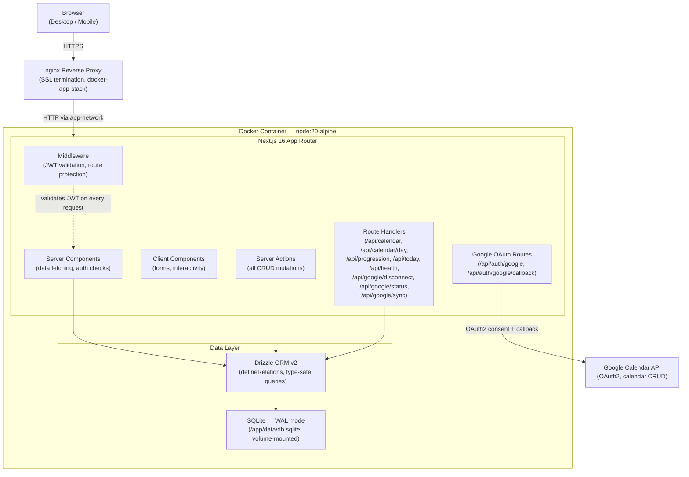
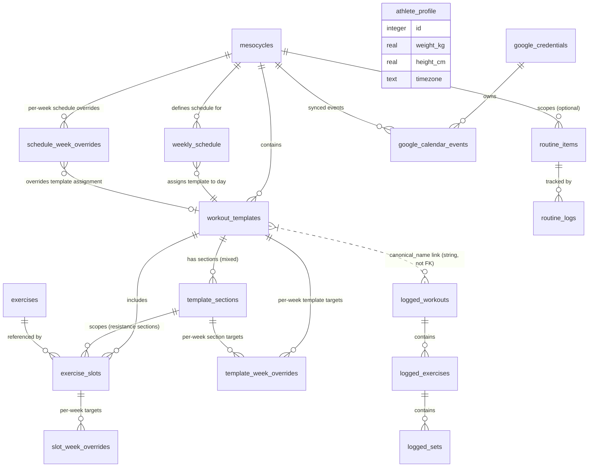

# Architecture: Fitness Tracking App

> Personal fitness planning + logging app. Desktop for coaching/planning, mobile for post-workout logging. Replaces a 4-sheet Excel system. See [PRD](prd.md) for full requirements.

## System Overview

A single-user fitness planning and logging app that separates **plan** (mutable, cascading) from **log** (immutable, snapshotted). Built for a coach+athlete context: a desktop UI for mesocycle design and progression review, and a mobile-optimized UI for post-workout logging. Core innovation: template changes cascade automatically across future weeks while logged history stays permanently frozen at the moment of logging.

Stack: Next.js 16 App Router, SQLite (WAL mode), Drizzle ORM v2, shadcn/ui, Tailwind v4, Docker on a Hostinger VPS (Ubuntu 24.04).

**Design principles:**
- Plan/log separation is the core invariant: templates are mutable config, logs are permanent records
- Cascade by default: template changes propagate forward automatically; user confirms scope (this phase / future / all)
- Snapshot on log: at write time, the full planned template is frozen into the log record — history never breaks when the plan evolves
- Modular domains: exercises, mesocycles, logging, and routines have clear API boundaries for future extraction (see ADR-008)

## Component Diagram

See ADR-001 (SQLite decision) and ADR-004 (hybrid API decision).

## Data Model

Seventeen tables split into four layers. See `lib/db/schema.ts` for column definitions and `lib/db/relations.ts` for Drizzle v2 `defineRelations` config. See ADR-002 (mesocycle-scoped templates) and ADR-003 (deload as separate schedule) for the structural decisions behind this schema.

### Planning Layer (mutable, editable)

| Table | Purpose |
|-------|---------|
| `exercises` | Global exercise library — reference data shared across all mesocycles and templates |
| `exercise_slots` | Junction table placing an exercise into a template with set/rep/weight/RPE targets and ordering; optional `section_id` FK for mixed templates |
| `template_sections` | Ordered sections within a mixed-modality template; each section has its own modality (resistance/running/mma) and modality-specific fields |
| `workout_templates` | Named workout plans (e.g. Push A, Easy Run) scoped to a mesocycle; carry a `canonical_name` slug for cross-phase linking |
| `mesocycles` | Training phases: N work weeks + optional deload week; status lifecycle (planned → active → completed) |
| `weekly_schedule` | Day-to-template assignment grid; keyed by `(mesocycle_id, day_of_week, week_type, time_slot, cycle_position)`; `time_slot` (HH:MM) + `duration` (minutes) are NOT NULL with defaults; `cycle_length` (default 1 = no rotation) and `cycle_position` (1-based, default 1) support per-week template rotation |
| `slot_week_overrides` | Per-week overrides for exercise slot targets (sets/reps/weight/RPE); enables week-by-week periodization within a mesocycle |
| `schedule_week_overrides` | Per-week schedule overrides for moving/removing workouts on specific weeks; links source+target via `override_group`; null `template_id` = rest/removed |
| `template_week_overrides` | Per-week overrides for template-level targets (distance/duration/pace/intervals); enables week-by-week periodization for running and mixed templates |
| `routine_items` | Daily habit items with flexible scope: global, per-mesocycle, date-range, or skip-on-deload |

### Logging Layer (immutable after save)

| Table | Purpose |
|-------|---------|
| `logged_workouts` | Immutable workout record; stores `log_date` (YYYY-MM-DD calendar date), `logged_at` timestamp, full `template_snapshot` JSON (with `version` field), and `canonical_name` string for cross-phase queries |
| `logged_exercises` | Normalized per-exercise log row enabling SQL analytics (progression charts, volume tracking) |
| `logged_sets` | Normalized per-set log row with actual reps, weight, and RPE |
| `routine_logs` | Daily routine completion records (done via field entry / explicitly skipped) with per-field values: weight, length, duration, sets, reps |

### Config Layer (singleton)

| Table | Purpose |
|-------|---------|
| `athlete_profile` | Single-row athlete configuration: body weight, height, date of birth, sex, training start date, timezone; used for progression calculations, bodyweight-relative metrics, and Google Calendar sync |

### Google Calendar Layer (external sync)

| Table | Purpose |
|-------|---------|
| `google_credentials` | OAuth2 tokens for Google Calendar API access; single row per user with access/refresh tokens, expiry, and calendar ID |
| `google_calendar_events` | Mapping between schedule entries and Google Calendar events; tracks sync state (pending/synced/error) per mesocycle+template+date |

**Cross-layer link**: `workout_templates.canonical_name` ↔ `logged_workouts.canonical_name` — string slug match, not a foreign key. See ADR-006.

**Snapshot strategy**: At log time, a `template_snapshot` JSON and normalized rows are both created atomically in one transaction. Snapshot preserves exact planned state for display; normalized rows enable analytics queries. See ADR-005.

**Cascade UX**: When a template is edited, the user selects a propagation scope: _this mesocycle only_, _this + all future unlogged_, or _all phases_. Cascade targets are found by querying `canonical_name` across active/planned mesocycles. Completed mesocycles and already-logged workouts are never modified. See ADR-002.

**Template modalities**: `workout_templates` supports four modality types — resistance (sets/reps/weight, linked to `exercise_slots`), running (interval-based or continuous, interval data stored as JSON array on the log), MMA/BJJ (occurrence + duration), and mixed (ordered sections via `template_sections`, each with its own modality). Modality determines which fields are rendered in both the planning and logging UIs. Mixed templates render sections sequentially with modality-specific content per section.

**Clone-on-create**: Creating a new mesocycle from an existing one copies all `workout_templates`, `exercise_slots`, and `weekly_schedule` rows atomically. Cloned templates retain the same `canonical_name` slugs with new IDs, preserving cross-phase linking for progression queries. This is a one-step operation (no separate "clone" action after create). See ADR-003 for deload schedule handling.

## API Boundaries

Hybrid pattern: Server Actions for all mutations, Route Handlers for computed reads and external API surface. See ADR-004.

| Pattern | Used For | Examples |
|---------|----------|---------|
| **Server Actions** | All form mutations (create, update, delete, log) | Create exercise, update template, log workout, clone mesocycle, cascade edit, mark routine done, disconnect Google |
| **Route Handlers** | Computed reads, health check, OAuth flows, future API consumers | `GET /api/calendar`, `GET /api/calendar/day`, `GET /api/progression`, `GET /api/today`, `GET /api/health`, `POST /api/coaching/summary`, `GET /api/auth/google`, `GET /api/auth/google/callback`, `POST /api/google/disconnect`, `GET /api/google/status`, `POST /api/google/sync` |

Route Handlers are intentionally kept for reads that may serve V2 consumers (LLM coach, Garmin integration, ecosystem aggregator). Server Actions save boilerplate on 15+ mutation operations with automatic cache revalidation and end-to-end type safety.

### Domain Groups

| Domain | Responsibility |
|--------|---------------|
| Auth | Login/logout, JWT cookie issuance, session validation |
| Exercises | Exercise library CRUD — the global reference dataset |
| Mesocycles | Phase lifecycle management, clone-on-create, status transitions |
| Templates + Slots | Workout template CRUD, exercise slot management, cascade UX |
| Schedule | Weekly day-to-template assignment, normal + deload variants |
| Logging | Workout log creation (snapshot + normalized rows), immutable after save |
| Routines | Routine item CRUD with flexible scoping, daily log tracking |
| Calendar / Progression | Computed views: projected calendar, exercise progression charts, today's sessions (multi-session per day) |
| Coaching | Summary generation: assembles athlete profile, current plan, recent sessions, progression trends, and subjective state into a structured markdown brief for coaching review |
| Google | OAuth2 client (`lib/google/client.ts`), token management with auto-refresh, Calendar API access (timezone read, calendar creation), credential queries + connection status + sync status counts (`lib/google/queries.ts`), event mapping lookups, disconnect action (`lib/google/actions.ts`), push-sync engine (`lib/google/sync.ts`): `syncMesocycle` (batch-project all workouts, idempotent via pre-delete), `syncScheduleChange` (diff-based assign/remove/move/reset), `syncCompletion` (checkmark update with 404 recreation, template-filtered lookup), `retryFailedSyncs` (re-attempt all error-state events), `deleteEventsForMesocycle` (bulk-delete on mesocycle deletion); pure date projection helpers (`lib/google/sync-helpers.ts`): `projectAffectedDates`, `projectWeekDates`, `getDateForWeekDay`; status/sync route handlers (`/api/google/status`, `/api/google/sync`); types in `lib/google/types.ts`. Schedule and mesocycle actions call sync functions fire-and-forget (`.catch(() => {})`) so local mutations never fail due to Google API errors. |

Response format follows standard JSON envelopes with appropriate HTTP status codes.

## Auth Strategy

Single-user auth. No registration, no database-stored users.

- **Credentials**: `AUTH_USERNAME` and `AUTH_PASSWORD_HASH` from environment variables
- **JWT**: issued via `jose` library — Edge-compatible, no `better-sqlite3` in middleware
- **Cookie**: `httpOnly`, `secure`, `sameSite=lax`, stored as `auth-token`
- **Login flow**: `POST /api/auth/login` validates credentials, issues JWT cookie; `POST /api/auth/logout` clears it
- **Middleware**: validates JWT on every request; protects all routes except `/login` and `/api/auth/*`
- **No session storage**: JWT is stateless; no server-side session table required
- **Password hash**: `AUTH_PASSWORD_HASH` is a bcrypt hash. The login route hashes the submitted password and compares with `jose`-compatible bcrypt. Token expiry is configurable via `JWT_EXPIRES_IN` env var (default: 7 days).
- **Route protection scope**: All routes under `/(app)` are protected. Public routes: `/login`, `/api/auth/login`, `/api/auth/logout`, `/api/health`.
- **Google OAuth**: OAuth2 flow for Google Calendar integration (not for app login). `GET /api/auth/google` initiates consent redirect; `GET /api/auth/google/callback` exchanges code for tokens. CSRF protection via httpOnly state cookie. Tokens stored in `google_credentials` table. Client: `lib/google/client.ts` using `googleapis` + `google-auth-library`. Disconnect via `POST /api/google/disconnect` (deletes credentials + event mappings; optionally deletes the Google Calendar). Requires env vars: `GOOGLE_CLIENT_ID`, `GOOGLE_CLIENT_SECRET`, `GOOGLE_REDIRECT_URI`.

## Infrastructure

### Docker

- **Base image**: `node:20-alpine` with `pnpm`
- **Output mode**: `standalone` (self-contained, minimal image size)
- **SQLite volume**: named Docker volume mounted at `/app/data/`; survives container restarts
- **Ports**: standalone dev = `3000`; orchestrated in docker-app-stack = `3002` (expense-tracker uses `3001`)
- **Reverse proxy**: nginx in docker-app-stack handles SSL termination and proxies to the app container via the shared `app-network` bridge

### Database

- **Engine**: SQLite — embedded, no separate DB container. See ADR-001.
- **WAL mode** + 4 PRAGMAs applied at connection init: `journal_mode=WAL`, `busy_timeout=5000`, `synchronous=NORMAL`, `foreign_keys=ON`
- **Migrations**: `drizzle-kit generate` → `drizzle-kit migrate`. Never `drizzle-kit push` in production.
- **Backups (V1)**: manual copy of the SQLite file. Automated backup script is V2.
- **Schema**: `lib/db/schema.ts` (Drizzle v2 `defineRelations` API). See ADR-007.

### Operations

- **Health check**: `GET /api/health` — returns `{ status: "ok", db: "connected" }`. Used by nginx upstream health checks and future ecosystem aggregation (ADR-008).
- **Monitoring**: health endpoint only (V1); no centralized log aggregation or alerting
- **CI/CD**: not in V1 scope; deployment is manual (`docker compose pull && docker compose up -d`)
- **Environment variables**: `AUTH_USERNAME`, `AUTH_PASSWORD_HASH`, `JWT_SECRET`, `DATABASE_URL` (path to SQLite file), `GOOGLE_CLIENT_ID`, `GOOGLE_CLIENT_SECRET`, `GOOGLE_REDIRECT_URI` (for Google Calendar OAuth)
- **Orchestration**: `docker-app-stack` repo manages multi-app nginx config; fitness-app runs as a peer to expense-tracker and tutor-ai

## Key Tradeoffs

These decisions reflect deliberate choices for a single-user, self-hosted app. Each tradeoff is revisitable if requirements change.

| Optimized For | Sacrificed |
|---------------|-----------|
| Single-user simplicity | Multi-user scalability — no row-level auth, no tenancy model |
| Plan/log separation (immutable snapshots) | Edit-after-save flexibility — logged workouts cannot be corrected |
| Cascade UX (one edit propagates forward automatically) | Schema simplicity — `canonical_name` string linking adds conceptual overhead vs a plain FK |
| Mobile logging speed (pre-filled from plan, 2-min target) | Desktop logging UX — desktop is coach context, not logging focus |
| SQLite operational simplicity | Concurrent write access + full-text search capability |
| Hybrid API (Server Actions + Route Handlers) | Uniform testing approach — Server Actions are harder to curl/test in isolation |

## Implementation Conventions

Key conventions for executor agents implementing this app. See `.sisyphus/plans/fitness-app.md` for full task-level detail.

- **Date storage**: Use `integer({ mode: 'timestamp' })` for events (logged_at, created_at); use `text` for calendar dates (e.g. `2026-03-15`) to avoid timezone drift
- **JSON columns**: Use `text({ mode: 'json' }).$type<T>()` — never `blob`; always include a `version: number` field in snapshot types for future migrations
- **Drizzle relations**: Use `defineRelations` (v2 API) — NOT the old `relations()` used in the expense-tracker sibling. See ADR-007.
- **SQLite init**: Apply 4 PRAGMAs on every connection: `journal_mode=WAL`, `busy_timeout=5000`, `synchronous=NORMAL`, `foreign_keys=ON`
- **Middleware constraint**: Cannot import `better-sqlite3` in `middleware.ts` (Edge runtime). JWT validation via `jose` only.
- **IDs**: Auto-increment integers — no UUIDs. Single-user app, no distributed ID requirements.
- **Migrations**: Always `drizzle-kit generate` then `drizzle-kit migrate`. Never `push`.
- **Error responses**: Standard JSON error envelope with appropriate HTTP status codes.
- **Testing**: Vitest for unit/integration tests; Playwright for E2E. Server Actions are tested via Vitest with a test database. Route Handlers are tested via curl/Playwright. See `docs/dev-workflow.md` for local dev setup and test commands.
- **Immutability enforcement**: No UPDATE or DELETE on `logged_workouts`, `logged_exercises`, `logged_sets`, or `routine_logs` tables after initial INSERT. Enforced at the application layer (no DB trigger needed for single-user).

## Open Questions (V2)

These items are explicitly out of V1 scope. Noted for future consideration only. See ADR-008 for extensibility hooks.

- **Variable-distance intervals** (ladder runs) — V1 supports uniform intervals only (single count + distance)
- **Materialized PR records table** — FitTrackee pattern for personal-record tracking without full log scan
- **LLM-assisted progression** — AI as coach sounding board for programming decisions and log review
- **Ecosystem integration** — fitness as a module in a broader life management / second-brain system
- **Garmin / Strava sync** — V1 defers all run metrics to Garmin; sync is V2
