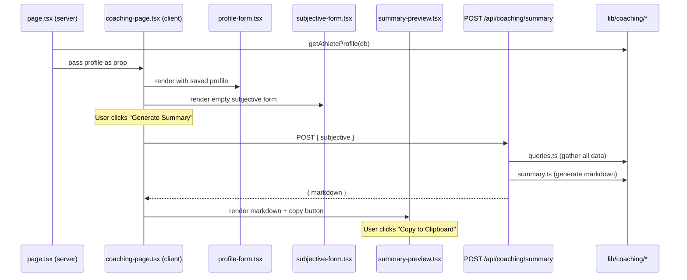

# Tech Design: Coaching Summary

> Dedicated `/coaching` page that generates a markdown snapshot of training state for LLM coaching conversations. User fills ephemeral subjective fields, hits generate, previews markdown, copies to clipboard.

See [architecture.md](architecture.md) for system overview, data model, and API conventions.

## Data Model

### New table: `athlete_profile`

Single-row table. All fields nullable — user fills in what they want.

```sql
athlete_profile
  id              integer PK autoIncrement
  age             integer
  weight_kg       real
  height_cm       real
  gender          text
  training_age_years integer
  primary_goal    text
  injury_history  text
  created_at      integer (timestamp)
  updated_at      integer (timestamp)
```

Added to `lib/db/schema.ts` planning layer. Not immutable — freely editable. Migration via `drizzle-kit generate` + `drizzle-kit migrate`.

### Subjective state — NOT persisted

Ephemeral form state on the `/coaching` page:

```typescript
type SubjectiveState = {
  fatigue: number      // 1-5
  soreness: number     // 1-5
  sleep: number        // 1-5
  injuries: string     // free text
  notes: string        // free text
}
```

Lives only in client component state. Passed to the summary endpoint in the request body.

## Domain Module: `lib/coaching/`

```
lib/coaching/
  queries.ts    -- read helpers for summary data gathering
  actions.ts    -- server actions: saveAthleteProfile
  summary.ts    -- markdown generator (pure function)
  types.ts      -- shared types (SubjectiveState, CoachingSummaryInput, etc.)
```

### `types.ts`

```typescript
export type AthleteProfileInput = {
  age?: number | null
  weight_kg?: number | null
  height_cm?: number | null
  gender?: string | null
  training_age_years?: number | null
  primary_goal?: string | null
  injury_history?: string | null
}

export type SubjectiveState = {
  fatigue: number
  soreness: number
  sleep: number
  injuries: string
  notes: string
}

export type CoachingSummaryRequest = {
  subjective: SubjectiveState
}
```

### `queries.ts`

Gathers all data needed for the summary. Each function returns a section-ready shape.

| Function | Source tables | Returns |
|----------|-------------|---------|
| `getAthleteProfile(db)` | `athlete_profile` | Profile row or null |
| `getCurrentPlan(db)` | `mesocycles`, `workout_templates`, `weekly_schedule`, `exercise_slots`, `exercises` | Active meso + template list with exercise details |
| `getRecentSessions(db, weeks)` | `logged_workouts`, `logged_exercises`, `logged_sets` | Last N weeks of logged sessions with exercises + sets |
| `getProgressionTrends(db)` | Reuses `getProgressionData` from `lib/progression/queries.ts` | Per-exercise weight/volume trends for all canonical names in active meso |
| `getUpcomingPlan(db, today)` | Reuses `getCalendarProjection` pattern from `lib/calendar/queries.ts` | Next 2 weeks of projected sessions |

`getRecentSessions` — queries `logged_workouts` with `log_date >= cutoff` (4 weeks back from today), joins through `logged_exercises` and `logged_sets`. Returns chronologically ordered session summaries with per-exercise top sets.

`getProgressionTrends` — iterates all `canonical_name` values from the active mesocycle's templates, calls existing `getProgressionData` for each. Filters to last 4 weeks of data points.

### `actions.ts`

Single server action:

```typescript
'use server'
export async function saveAthleteProfile(input: AthleteProfileInput): Promise<void>
```

Upsert pattern: if row exists (id=1), UPDATE. Otherwise INSERT. Revalidates `/coaching`.

### `summary.ts`

Pure function — no DB access. Takes pre-fetched data, returns markdown string.

```typescript
export function generateSummary(input: {
  profile: AthleteProfile | null
  plan: CurrentPlan | null
  sessions: RecentSession[]
  trends: ProgressionTrend[]
  subjective: SubjectiveState
  upcoming: UpcomingDay[]
}): string
```

Outputs 6 markdown sections in order:

#### 1. Athlete Profile
```markdown
## Athlete Profile
- Age: 32, Weight: 85kg, Height: 180cm, Gender: Male
- Training age: 8 years
- Primary goal: Hypertrophy
- Injury history: L5/S1 disc herniation (2023), managed
```
Omits fields that are null.

#### 2. Current Plan
```markdown
## Current Plan
**Mesocycle:** Hypertrophy Block 3 (Week 4/6, active)
**Schedule:**
- Mon AM: Push A (Bench Press 4×8@80kg, OHP 3×10@40kg, ...)
- Tue PM: Pull A (Deadlift 3×5@140kg, Rows 4×8@70kg, ...)
- ...
```
Lists each scheduled day with template name and top exercises (main lifts first, max 4 per template).

#### 3. Recent Sessions (4 weeks)
```markdown
## Recent Sessions (last 4 weeks)
### 2026-03-24 — Push A
- Bench Press: 4×8@82.5kg (RPE 8)
- OHP: 3×10@42.5kg (RPE 7)
- Rating: 4/5
- Notes: "Felt strong, good sleep"

### 2026-03-22 — Pull A
...
```
Each logged workout with exercises, top set per exercise, rating, notes.

#### 4. Progression Trends
```markdown
## Progression Trends
- **Bench Press:** 80→82.5kg (+3.1%) over 4 weeks, volume 10,240→11,220kg
- **Deadlift:** 140→140kg (flat), volume stable
- **OHP:** 40→42.5kg (+6.3%), steady progression
```
Per canonical exercise: weight delta, volume delta, trend direction.

#### 5. Subjective State
```markdown
## Current Subjective State
- Fatigue: 3/5, Soreness: 2/5, Sleep: 4/5
- Current injuries: Left shoulder impingement, mild
- Notes: Deload may be needed next week
```

#### 6. Upcoming Plan
```markdown
## Upcoming Plan (next 2 weeks)
- Wed 26/03: Push B (AM)
- Thu 27/03: Rest
- Fri 28/03: Pull B (PM)
- ...
```

## API Design

### `POST /api/coaching/summary`

Route handler (computed read per ADR-004 — returns generated content, not a CRUD mutation).

**Request body:**
```json
{
  "subjective": {
    "fatigue": 3,
    "soreness": 2,
    "sleep": 4,
    "injuries": "Left shoulder impingement",
    "notes": "Considering a deload"
  }
}
```

**Response:** `200 OK`
```json
{
  "markdown": "## Athlete Profile\n..."
}
```

**Flow:**
1. Parse + validate `SubjectiveState` from body
2. Call `queries.ts` functions to gather all sections
3. Call `generateSummary()` with gathered data + subjective state
4. Return `{ markdown }` as JSON

POST (not GET) because the request carries a body (subjective state). Still a read operation — no side effects.

## Component Architecture

```
app/(app)/coaching/
  page.tsx                          -- server component: loads profile, passes to client

components/coaching/
  coaching-page-client.tsx          -- client component: orchestrates form + preview
  profile-form.tsx                  -- client component: athlete profile form (persisted)
  subjective-state-form.tsx         -- client component: ephemeral subjective fields
  summary-preview.tsx               -- client component: markdown preview + copy button
```

### Data Flow



### page.tsx (server component)

Loads `athlete_profile` from DB. Passes to `<CoachingPage profile={profile} />`.

### coaching-page.tsx (client component)

Manages state:
- Profile form values (initialized from server prop, saved via `saveAthleteProfile` server action)
- Subjective form values (local state only)
- Generated markdown (from API response)
- Loading/error states

"Generate Summary" button triggers `fetch('/api/coaching/summary', { method: 'POST', body: { subjective } })`.

### profile-form.tsx

Standard form fields for `athlete_profile`. Save button calls `saveAthleteProfile` server action. No page reload — uses `useTransition`.

### subjective-form.tsx

Slider/select for fatigue, soreness, sleep (1-5 scale). Textareas for injuries + notes. Controlled by parent state.

### summary-preview.tsx

Renders markdown as styled `<pre>` block (monospace, preserves formatting). "Copy to Clipboard" button via `navigator.clipboard.writeText()`. No rich markdown rendering needed — the point is to paste raw markdown into an LLM chat.

## Nav Integration

Add "Coaching" link to the app nav (`components/layout/nav-items.ts`). Desktop sidebar + mobile bottom nav. Icon: `BrainCircuit` from lucide-react.

## Migration

Single migration adding `athlete_profile` table:

```bash
pnpm db:generate   # generates migration SQL
pnpm db:migrate    # applies to SQLite
```

No data backfill needed — table starts empty, all fields nullable.

## Open Questions

- Max session count in "Recent Sessions" — cap at ~20 to keep markdown under ~2k tokens?
- Include routine completion data in summary? Probably not for V1 — keeps it focused on training.
- Rate limiting on summary generation? Single-user, probably unnecessary.
